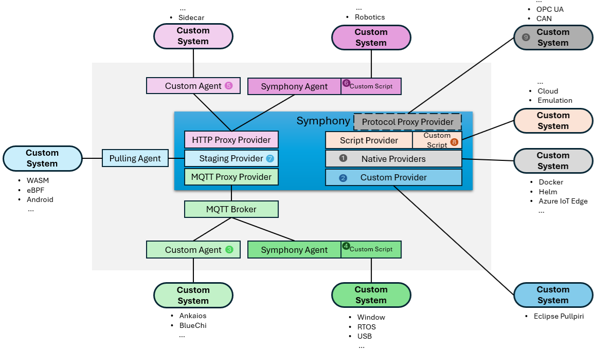

# Eclipse Symphony
Symphony, as a toolchain orchestrator, is designed to provide consistent, end-to-end management workflows across heterogeneous edge environments. Key features include:
* Deploying distributed applications and device updates across various device types.
* Managing workflows with distributed stages, such as running tests on remote machines and collecting results.
* Centrally managing configurations with context-specific overrides.

Symphony provides flexible options to connect to underlying systems like [Eclipse BlueChi](https://bluechi.readthedocs.io/en/latest/), [Eclipse Pullpiri](https://projects.eclipse.org/projects/automotive.pullpiri) and [Eclipse Ankaios](https://github.com/eclipse-ankaios/ankaios), as shown in the following diagram. A key construct of extension is called a **provider**. Symphony allows extensions with two types of providers:
 * A **Target Provider** that participates in Symphony's state-seeking process, such as applying a software to a custom system.
 * A **Stage Provider** that participates in Symphony's distributed workflow, such as running a task on a specific machine.

 For this challenge, we'll mostly focus on the target providers. However, we are also open to scenarios that leverage custom stage providers.



1. Symphony offers a collection of native providers to interact with common software deployment and management tools like [Helm](https://v3.helm.sh/), [Docker](https://www.docker.com/), [Azure IoT Edge](https://azure.microsoft.com/en-us/products/iot-edge), [Device Update for IoT Hub](https://learn.microsoft.com/en-us/azure/iot-hub-device-update/understand-device-update), [Windows 10/11 Sideloading](https://learn.microsoft.com/en-us/windows/application-management/sideload-apps-in-windows) and [Kubernetes artifacts](https://kubernetes.io/).
2. Symphony also welcome contributions of providers, such as the recent [Eclipse Pullpiri](https://projects.eclipse.org/projects/automotive.pullpiri) provider contributed by LGE.
3. Symphony supports a remote agent written in any programming language and communicates with the Symphony control plane over MQTT. A remote agent can:
    * Participate in Symphony state-seeking process, such as applying software to a custom system.
    * Participate in Symphony workflow, such as running a task on a specific system.

   For example, [Eclipse Ankaios](https://github.com/eclipse-ankaios/ankaios) is exploring this route using Symphony's Python SDK (PoC).

4. Symphony also provides a pre-built agent over MQTT. This full-featured agent is able to load additional providers, such as a script provider that can perform software update operations using [PowerShell](https://learn.microsoft.com/en-us/powershell) or [Bash](https://www.gnu.org/software/bash/manual/bash.html). This route can be used for USB-attached devices such as flashing a [RTOS](https://en.wikipedia.org/wiki/Real-time_operating_system) system.      
5. Symphony also allows a remote agent to implement Symphony target provider interface as a web server. Although this can be used for a remote agent, it's more commonly used in a sidecar pattern for process isolation on the same control plane (such as granting minimum required access to a provider process).
6. Similar to the MQTT-based agent, Symphony also provides a pre-built agent over HTTP that is able to load additional providers, such as a script provider.
7. For constrained devices, you can implement a pulling agent, which is essentially a web client querying Symphony for stated states for the represented target devices. Symphony offers a sample pulling agent named Piccolo that supports [Docker](https://www.docker.com/), [WebAssembly](https://webassembly.org) and [eBPF](https://ebpf.io/) payloads. Piccolo is written in Rust and is 4MB in side. We anticipate even smaller pulling agents can be authored for the most constrained devices.
8. The script provider can also be directly loaded to the Symphony control plane. This can be used for cases like managing cloud-based resources, or resources co-located with the control plane itself.
9. Symphony provides HTTP(S) and MQTT binding out-of-box. Additional protocols like [CAN](https://en.wikipedia.org/wiki/CAN_bus) can be supported with additional protocol bindings.

## Installing Symphony

### Using Maestro
You can use Symphony's CLI, maestro, to install Symphony. To get maestro, run this command:
```bash
wget -q https://raw.githubusercontent.com/eclipse-symphony/symphony/master/cli/install/install.sh -O - | /bin/bash
```
And once maestro is installed, you can use this command to install Symphony to your current K8s context:
```bash
maestro up
```
> **NOTE:** If you don't have a current K8s context, maestro can install Minikube on your machine first and then install Symphony.

### Using Helm
Alternatively, you can use Helm (v3) to install Symphony on to a Kubernetes cluster such as [AKS](https://learn.microsoft.com/en-us/azure/aks/), [K3s](https://k3s.io/) and [Minikube](https://minikube.sigs.k8s.io/docs/):

```bash
helm install symphony oci://ghcr.io/eclipse-symphony/helm/symphony --version '0.48.32'
```
> **NOTE:** For this hackathon, make sure to use the **0.48.32** version.


## Basic Usage of Symphony

Once you've installed Symphony, you can use standard K8s tools like `kubectl` to interact with Symphony. Essentially, you need to create `Solution` objects that describe your applications, `Target` objects that describe your infrastructure, and `Instance` objects that describe an deployment, which maps a `Solution` to one mor multiple `Target`s. 

A `Solution` is comprised of one or multiple `Component`, and each `Component` has an associated `type`. Corresponding, a `Target` has one or more bindings that bind a component type to a Target Provider. 

You can follow instructions [here](https://github.com/eclipse-symphony/symphony/blob/main/docs/symphony-book/get-started/deploy_prometheus_k8s.md) to deploying a hello-world solution to K8s using Symphony. And additional scenarios can be found [here](https://github.com/eclipse-symphony/symphony/tree/main/docs).

## Deploy a MQTT Broker
In this hackathon, we'll use a MQTT broker to facilitate communication between Symphony and the remote agent, which you'll run from your machine or on your target device. 
We offer a sample deployment file at `eclispe-symphony/mosquitto/mosquitto.yaml`, which you can use to deploy a [mosquitto](https://mosquitto.org/) test MQTT broker with anoymous access enabled. 
```bash
kubectl apply -f mosquitto/mosquitto.yaml
```
Once deployment is complete, you should see a `mosquitto-service` service in your service list. This will the broker your agents connect to.
```bash
kubectl get svc
NAME                TYPE           CLUSTER-IP     EXTERNAL-IP       PORT(S)
...
mosquitto-service   LoadBalancer   10.0.231.136   172.179.118.100   1883:32640/TCP
...
```

## Prepare Truck Templates
When a truck docks at a field office, a Symphony workflow (`Campaign`) is executed to register the truck as a `Target` object with Symphony, using a predefined truck template. We offer four sample truck templates (as Catalog objects) under the `eclipse-symphony/truck-templates` folder:

| Template (Catalog) | Description |
|--------|--------|
| `mock-truck.yaml` | A truck that uses a mock Target provider, which doesn't do any actual deployments. |
| `reefer-truck.yaml` | A reefer truck with built-in refrigeration units to transport perishable goods like food and pharmaceuticals. | 
| `box-truck.yaml` | A Trucks with enclosed cargo areas. |
| `flatbed-truck.yaml` | A Truck with an open, flat trailer, used for transporting large, heavy items that don’t fit within standard truck dimensions. |

Except for the `mock-truck`, all truck templates are configured to use a MQTT Target Provider that delegate state-seeking calls to a remote agent, which you'll set up later.

 To provision these templates, simply use the kubectl command from the `truck-templates` folder:
```bash
# under eclispe-symphony/truck-templates folder:
kubectl apply -f .
```
Once the Catalogs are provisioned, you can use `kubectl` to list them out (Each `Catalog` belongs to a `CatalogContainer`, which can contain multiple versions of the `Catalog`):
```bash
kubectl get catalogcontainer

NAME            AGE
box-truck       8s
flatbed-truck   8s
mock-truck      5m33s
reefer-truck    102s

kubectl get catalog

NAME                 AGE
box-truck-v-v1       12s
flatbed-truck-v-v1   12s
mock-truck-v-v1      5m36s
reefer-truck-v-v1    106s
```

## Prepare Truck Docking Workflow
The truck docking workflow is defined as a Symphony `Campaign` object. To define the docker working flow:
```kubectl
# under eclipse-symphony/workflows folder:
kubectl apply -f docking.yaml
```

## Deploy Symphony Sample Portal (Opera)

TBD

## Docking a Mock Truck
To test out the docking workflow, you can create an `Activation` object to activate the above `Campaign`. For example, the following activation activates the docking workflow using the `mock-truck` template:

```yaml
apiVersion: workflow.symphony/v1
kind: Activation
metadata:
  name: mock-truck-docking-activation
spec:
  campaign: "docking:v1"
  stage: ""
  inputs:    
    truck-template: mock-truck:v1
```
To apply the activation, use `kubectl`:
```bash
kubectl apply -f <your activation file>
```

> **NOTE:** Once an activation is created it can't be updated, as it serves as workflow executiong record. To re-activate a campaign, you'll need to re-create the activation object (by deleting it and recreating it), or to create a new activation object.

## Launching a Symphony Agent
You can launch a Symphony Agent using `maestro` (see [Installing Symphony](#installing-symphony) section for instructions to install `maestro` using a single command).
When launching the agent with MQTT binding, you need to supply a few parameters:
| Parameter | Value |
|--------|--------|
| `mqtt-broker` | MQTT broker address. If you've deployed MQTT broker as instructed above, you should set this value to the public IP of your `mosquitto-service`, for example `TCP://172.179.118.110:1883`. |
| `mqtt-client-id` | An unique MQTT client id of your choice. |
| `target` | Symphony Target object name that this agent represents. This needs to match with the Symphony Target object name. |

For example:
```bash
maestro agent --mqtt-broker TCP://172.179.118.110:1883 --mqtt-client-id mock-truck --target mock-truck
```

> **NOTE:** You can use a `--config-only` to generate the Agent configuration file only.